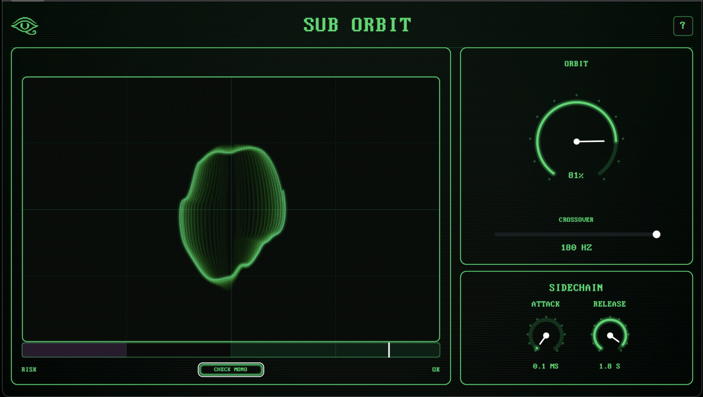

# SUB ORBIT

Mono-safe low-end stereoizer for VST3 and AU. Widens bass frequencies while preserving full mono compatibility.



SUB ORBIT splits your signal with a Linkwitz-Riley crossover, applies quadrature allpass stereo widening to the low band, and recombines cleanly. Sum to mono with zero phase cancellation.

## Features

- **Quadrature allpass stereoization** below a configurable crossover
- **Linkwitz-Riley crossover** (60-180 Hz) for transparent band splitting
- **Sidechain-driven width ducking** for automatic kick/bass clarity
- **Real-time goniometer** with phosphor persistence and CRT aesthetic
- **Correlation meter** showing mono safety at a glance
- **CHECK MONO** audition button for instant mono compatibility checks
- Supports 44.1, 48, 88.2, 96, 176.4, and 192 kHz sample rates
- Resizable UI (Cmd+1/2/3)

## Parameters

| Parameter | Range | Default | Description |
|-----------|-------|---------|-------------|
| **Orbit** | 0-100% | 0% | Stereo width amount |
| **Range** | 60-180 Hz | 100 Hz | Crossover frequency |
| **SC Amount** | 0-100% | 100% | Sidechain ducking depth (no UI knob — use DAW automation) |
| **SC Attack** | 0.1-100 ms | 10 ms | Sidechain envelope attack time |
| **SC Release** | 1-3000 ms | 300 ms | Sidechain envelope release time |

## Signal Flow

```
Input (Stereo)
  |
  +-- Linkwitz-Riley Crossover (at Range Hz)
  |     |
  |     +-- Low Band --> Mono Sum --> Quadrature Allpass Pair
  |     |                                |
  |     |                    cos(alpha)*I + sin(alpha)*Q --> Left
  |     |                    cos(alpha)*I - sin(alpha)*Q --> Right
  |     |                        ^
  |     |                        alpha = Orbit * (1 - sidechain ducking)
  |     |
  |     +-- High Band --> passed through unmodified
  |
  +-- Recombine (Low Widened + High Passthrough)
  |
Output (Stereo)
```

## Quick Start

1. Insert SUB ORBIT on a bass bus or stereo track
2. Turn up **Orbit** to widen the low end
3. Adjust **Range** to set where widening stops
4. Route a kick drum to the sidechain input to auto-duck width on transients
5. Watch the **goniometer** and **correlation meter** to stay mono-safe
6. Hold **CHECK MONO** to audition the summed output

## Installation

See [INSTALL.md](INSTALL.md) for platform-specific instructions (macOS, Windows, Linux).

## Build from Source

```sh
cmake -S . -B build -DCMAKE_BUILD_TYPE=Release
cmake --build build --config Release -j4
ctest --test-dir build --output-on-failure
```

Requires CMake 3.24+ and a C++20 compiler. Dependencies (JUCE 8.0.12, Catch2 v3.7.1) are fetched automatically.

See [DEVELOPMENT.md](DEVELOPMENT.md) for debug builds, Xcode setup, and formatting.

## Stack

JUCE 8.0.12 &middot; CMake 3.24+ &middot; C++20 &middot; Catch2 v3.7.1

## Keyboard Shortcuts

| Shortcut | Action |
|----------|--------|
| Cmd+1 | Small UI |
| Cmd+2 | Medium UI |
| Cmd+3 | Large UI |
| Right-click | Size menu |

## License

[MIT](LICENSE)

## Links

- [echoeslabmusic.com](https://www.echoeslabmusic.com)
- [Installation Guide](INSTALL.md)
- [Development Guide](DEVELOPMENT.md)
- [Changelog](CHANGELOG.md)
